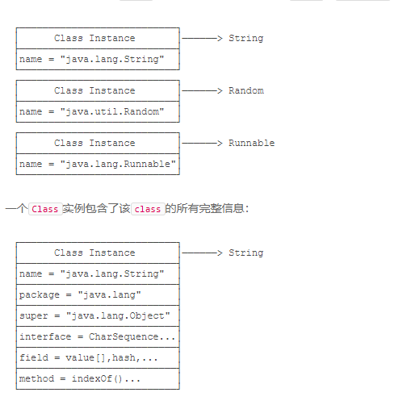

# 反射(Reflection)
## What is Reflection
除了int等基本的数据类型外，java的其他基本类型都是class(包括interface)  
如:**String,Object,Runnable,Exception**  
```Java
        Object n1 = Integer.valueOf("12");
        Number n2 = Double.valueOf(12.2);
        String s1 =Integer.valueOf(1); // error: 没有继承关系，不能直接赋值
```
并且class是JVM在执行过程中动态加载的，JVM在第一次读取到这个class时，将其加载到内存中去；并且每加载一种class，JVM就将为其创建一个***Class***实例(Note:Class是名为Class的class)，他的声明如下：
```Java
public final class Class{  
   private Class(){};  
}
```
比如在加载String类时，他首先读取 **Sring.class** 到内存中去，然后为String类创建一个Class的class并关联起来
```Java
Class cls = new Class(String);
```
这个Class的实例是由JVM创建的，查看JDK源码，Class类的构造方法是private的，即其只能由JVM调用创建Class实例，用户并不能调用创建。  
所以JVM所持有的所有Class实例都指向一个数据类型(class or interface)  

  

由于JVM为每个加载的class创建对应的Class实例，并在这个实例中保存了该class的所有信息，譬如packagename、类名、父类、实现的接口、所有方法、字段等，所以如果我们获取这个Class实例，那么我们就可以通过这个Class实例来获取到该实例对应的class的所有信息。  
这种通过Class实例获取class信息的方法叫做***反射(Reflection)***  
## 如何获取一个class的Class实例
### 1 通过一个class的静态变量class获取
```Java
Class cls = String.class
```
### 2 如果有实例的变量，那么可以通过getClass()方法获取
```Java
String s="Test";
Class cls=s.getClass();
```
### 3.如果记得实例的全名，可以通过静态方法Class.forName()获得  
```Java
Class cls = Class.forName("Java.lang.String");
```
因为Class实例在JVM中是唯一的，所以获取到的Class的实例都是同一个实例，所以
```Java
a=String.class;
String s="x";
c=s.getClass();
a==c;
```
是等价的。

## ***instance of*** 和 ***Class***的区别
用instanceof不但匹配指定类型，还匹配指定类型的子类。而用==判断class实例可以精确地判断数据类型，但不能作子类型比较。  
通常情况下，我们应该用instanceof判断数据类型，因为面向抽象编程的时候，我们不关心具体的子类型。只有在需要精确判断一个类型是不是某个class的时候，我们才使用==判断class实例。

## 用Class创建实例
当获得到一个Class实例，我们可以用它来创建对应的实例类型  
```Java
// 获取String的Class实例:
Class cls = String.class;
// 创建一个String实例:
String s = (String) cls.newInstance();
```
上述代码相当于new String()。通过Class.newInstance()可以创建类实例，它的局限是：只能调用public的***无参数构造方法***。带参数的构造方法，或者非public的构造方法都无法通过Class.newInstance()被调用。

## Summary
JVM为每个加载的class及interface创建了对应的Class实例来保存class及interface的所有信息；  

获取一个class对应的Class实例后，就可以获取该class的所有信息；  

通过Class实例获取class信息的方法称为反射（Reflection）；  

JVM总是动态加载class，可以在运行期根据条件来控制加载class。  

# 通过Class获取字段
## 获取Field
Field getField(name)：根据字段名获取某个***public***的field（包括父类）  
Field getDeclaredField(name)：根据字段名获取当前类的某个field（不包括父类）  
Field[] getFields()：获取所有***public***的field（包括父类）  
Field[] getDeclaredFields()：获取当前类的所有field（不包括父类）  

## 获取字段值
String 定义 ：
```Java
public final class String {
    private final byte[] value;
}
```

有童鞋会问：如果使用反射可以获取private字段的值，那么类的封装还有什么意义？  

答案是正常情况下，我们总是通过p.name来访问Person的name字段，编译器会根据public、protected和private决定是否允许访问字段，这样就达到了数据封装的目的。  

而反射是一种非常规的用法，使用反射，首先代码非常繁琐，其次，它更多地是给工具或者底层框架来使用，目的是在不知道目标实例任何信息的情况下，获取特定字段的值。  

此外，setAccessible(true)可能会失败。如果JVM运行期存在SecurityManager，那么它会根据规则进行检查，有可能阻止setAccessible(true)。例如，某个SecurityManager可能不允许对java和javax开头的package的类调用setAccessible(true)，这样可以保证JVM核心库的安全。  

```Java
Object targetObject = new targetClass(); //目标类的实例
Class clsOfTargetObject = targetObject.getClass();

Field fieldOfTargetObject = clsOfTargetObject.getDeclaredField("name");

Object value = fieldOfTargetObject.get(targetObject);
```
## 修改字段值
```Java
fieldOfTargetObject.set(originObject,targetValue);
```

## Summary
Java的反射API提供的Field类封装了字段的所有信息：  

通过Class实例的方法可以获取Field实例：getField()，getFields()，getDeclaredField()，getDeclaredFields()；  

通过Field实例可以获取字段信息：getName()，getType()，getModifiers()；  

通过Field实例可以读取或设置某个对象的字段，如果存在访问限制，要首先调用setAccessible(true)来访问非public字段。  

通过反射读写字段是一种非常规方法，它会破坏对象的封装。  


# 通过Class调用方法(Method)

## 获取方法
```Java
Method getMethod()(name,Class ... ); //获取某个public的方法(包括父类)
Method getDeclaredMetod(name, Class ... ); //获取当前类的某个方法(不包括父类)

Method[] getMethods(); // 获取所有public的方法(包括父类)
Method[] getDeclaredMethods(); //获取当前类的所有方法(不包括父类)
```

## 调用方法

通过对Method实例调用invoke方法，就可以调用其方法。
```Java
Method method = targetObject.class.getMethod(name,args.class);
Object value = method.invke(object,args);
```
调用静态方法时，obj设置为***null***即可

## Summary

Java的反射API提供的Method对象封装了方法的所有信息：

通过Class实例的方法可以获取Method实例：getMethod()，getMethods()，getDeclaredMethod()，getDeclaredMethods()；  

通过Method实例可以获取方法信息：getName()，getReturnType()，getParameterTypes()，getModifiers()；  

通过Method实例可以调用某个对象的方法：Object invoke(Object instance, Object... parameters)；  

通过设置setAccessible(true)来访问非public方法；  

通过反射调用方法时，仍然遵循多态原则。  

# 通过Class调用构造方法
```Java
Object object = objCls.newInstance();

// 通过Constructor
Constructor objCons = objCls.getConstructor(Args.class);
ValueObj value = objCons.newInstance(args);
```
## Summary
通过Class实例获取Constructor的方法如下：  
getConstructor(Class...)：获取某个public的Constructor；  
getDeclaredConstructor(Class...)：获取某个Constructor；  
getConstructors()：获取所有public的Constructor；  
getDeclaredConstructors()：获取所有Constructor。  
注意Constructor总是当前类定义的构造方法，和父类无关，因此不存在多态的问题。  
调用非public的Constructor时，必须首先通过setAccessible(true)设置允许访问。setAccessible(true)可能会失败。  

# 获取父类Class
一般对Class实例使用
```
getSuperclass()
```
获取其父类的Class实例
***除了Object外，其他的任何非interface的Class都必定存在一个父类型***
getInterfaces只返回当前类所直接实现的所有接口，不包含其父类实现的接口  
对interface的Class调用getSuperclass()则只会返回null，要得到其父接口需要调用getInterfaces()  

## 判断转型
```Java
// Integer i = ?
Integer.class.isAssignableFrom(Integer.class); // true，因为Integer可以赋值给Integer
// Number n = ?
Number.class.isAssignableFrom(Integer.class); // true，因为Integer可以赋值给Number
// Object o = ?
Object.class.isAssignableFrom(Integer.class); // true，因为Integer可以赋值给Object
// Integer i = ?
Integer.class.isAssignableFrom(Number.class); // false，因为Number不能赋值给Integer
```

# 动态代理
详情见代码DynamicProxy.java
