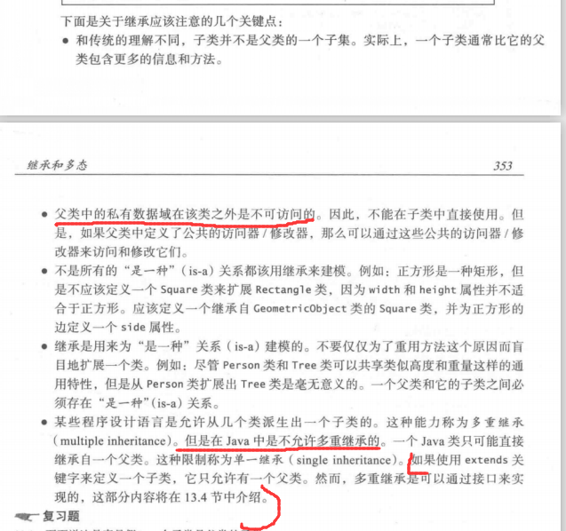
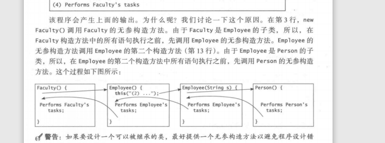

# 继承和多态
## extends  

## super
关键字super可以有两个用处  
### 1.调用父类的构造方法
构造方法用于构建一个类的实例。不同于属性和普通方法，父类的构造方法不会被子类所继承。它们只能使用关键字 super 从子类的构造方法中调用。  
调用父类构造方法的语法是：  
***super()或者super(parameters);***  
语句 super()和 super (arguments) 必须出现在子类构造方法的第一行  
构造方法可以调用重载的构造方法或父类的构造方法。如果它们都没有被显式地调用，编译器就会自动地将 superO 作为构造方法的第一条语句。  
**构造方法链条**

### 2.调用父类的方法  
一般在方法重写的时候使用

## 重写与重载
重栽意味着使用同样的名字但是不同的签名来定义多个方法。重写意味着在子类中提供一个对方法的新的实现。  

## Object类及其toString方法
Java中所有的类都继承自Object类，如果定义一个类时没有指定其extends，就默认继承自Object  
Object的toString方法默认情况下，它返回一个由该对象所属的类名、at 符号（@)以及该对象十六进制形式的内存地址组成的字符串。
